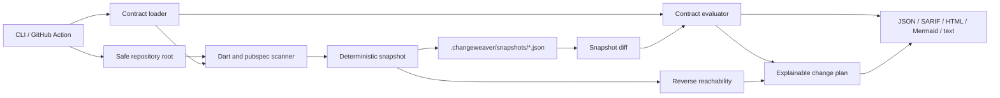

# ChangeWeaver Architecture

## Architectural intent

ChangeWeaver is a local-first, deterministic analysis tool. Its core does not know about Typer, GitHub Actions, HTML, or a specific file system layout beyond a small port. The application layer orchestrates use cases, adapters collect Dart/Flutter facts, and renderers translate stable domain results into terminal, JSON, SARIF, Mermaid, or HTML.

The initial implementation uses a pragmatic hexagonal architecture rather than a framework-heavy interpretation of Clean Architecture. Every dependency points inward toward domain contracts. The lexical Dart parser is intentionally conservative: when syntax is ambiguous, it reports an explicit limitation rather than inventing a relationship.

## Components

| Layer | Responsibility | Important modules |
|---|---|---|
| Domain | Immutable facts, graph algorithms, policy evaluation, exit semantics | `domain/models.py`, `domain/graph.py`, `domain/policy.py` |
| Application | Coordinates snapshot, diff, impact, check, and plan use cases | `application/services.py` |
| Adapters | Reads Dart/Flutter workspace facts and Git metadata | `adapters/dart_parser.py`, `adapters/workspace.py`, `adapters/git.py` |
| Infrastructure | Safe filesystem access and artifact serialization | `infrastructure/filesystem.py`, `infrastructure/serialization.py` |
| Presentation | CLI and stable output formats | `presentation/cli.py`, `presentation/renderers.py` |

## Data flow



## Domain model

A `Node` represents a Dart library, package, or workspace unit. An `Edge` represents a typed relation such as `imports`, `exports`, `part_of`, or `depends_on`. A `Snapshot` contains normalized nodes, edges, repository identity, analyzer version, source digest, and warnings. An `ArchitectureContract` contains ordered layers and import rules. A `Finding` contains a stable rule ID, severity, source, target, evidence, and explanation. A `ChangeSet` contains added, removed, and changed facts. An `ImpactReport` contains roots, reachable nodes, path samples, and a deterministic score. A `ChangePlan` contains ordered verification steps and a no-mutation guarantee.

The public JSON protocol is versioned with `protocol_version` and stable fields: `status`, `command`, `changes`, `diagnostics`, `warnings`, `result`, and `verification`. Renderers must not leak Python exception reprs or machine-specific absolute paths when a repository-relative path is available.

## Contract schema

The MVP accepts `changeweaver.yaml` at the repository root:

```yaml
version: 1
project:
  name: sample_app
  roots: [lib, packages]
  include: ['**/*.dart']
  exclude: ['**/*.g.dart', '**/*.freezed.dart', '.dart_tool/**']
architecture:
  layers:
    - name: presentation
      paths: ['**/presentation/**', '**/widgets/**']
    - name: domain
      paths: ['**/domain/**']
    - name: data
      paths: ['**/data/**', '**/repositories/**']
  rules:
    - id: presentation-cannot-import-data
      from: [presentation]
      deny: [data]
      severity: error
      message: Presentation must depend on domain abstractions, not data implementations.
analysis:
  max_path_samples: 8
  max_nodes: 10000
```

The schema is deliberately small. Unknown keys are rejected with source locations; rules are explicit; a missing classification is reported as `unclassified` rather than silently treated as valid.

## Algorithms

The scanner normalizes all paths to POSIX-style repository-relative strings. It extracts `import`, `export`, and `part` directives while preserving the URI and line number. Local `package:` imports are resolved through the workspace package map; relative imports are resolved against the importing file; SDK and external package imports become external nodes. Graph snapshots sort every collection and derive a SHA-256 digest from canonical JSON.

Reverse reachability uses an adjacency map from target to incoming sources. Impact roots are resolved from file paths or node IDs, then traversed breadth-first with a maximum-node safety limit. The score is explainable: `min(100, 20 + 10 * reachable_layers + 2 * reachable_nodes + 5 * boundary_crossings)` and is a prioritization signal, not a risk prediction.

Contract checks classify each file into the most specific matching layer. For each local edge, the evaluator checks whether the source layer is allowed to target the destination layer. A missing layer classification creates a warning unless strict mode is enabled. Findings are sorted by rule ID, source, target, and line so repeated runs are stable.

A snapshot diff compares canonical fact keys. It does not pretend to know semantic renames. When a node disappears and another appears, the result is reported as removal plus addition, with a warning that lexical analysis cannot prove identity.

## Error and exit model

| Exit code | Meaning |
|---:|---|
| 0 | Command completed and no enforced regression was found. |
| 1 | Enforced contract regression or requested check failed. |
| 2 | Invalid input, malformed contract, unreadable repository, or analysis could not run. |
| 3 | Baseline and current snapshot are not comparable, or the command was declined because identity is unsafe. |

Errors are typed and rendered as diagnostics. The CLI never catches all exceptions and reports success. A malformed YAML rule, path traversal attempt, or unsupported snapshot version must terminate with code 2 and a human-readable remediation.

## Security model

The root path is canonicalized once and all subsequent reads must remain beneath it. Excluded directories are skipped before reading, symlinks are not followed by default, and file size and node count limits prevent accidental resource exhaustion. The tool never evaluates Dart code, executes project scripts, invokes `flutter`, or fetches network resources in the MVP. Report output escapes HTML and SARIF message fields. No tokens, repository contents, or telemetry leave the local machine.

## Performance strategy

The first implementation favors predictable memory behavior and simple data structures. Scanning is linear in the number of included source files and bytes read. Graph operations are linear in nodes plus edges. Canonical JSON is generated once per artifact. The project will include fixtures and a benchmark command for a synthetic but reproducible local corpus; benchmark claims will only be documented after measurement.

## Extensibility strategy

The scanner is a port: later adapters can implement Dart Analyzer, Melos/Pub Workspace, or another language without changing domain algorithms. Renderers implement a small protocol. Policy packs are data files, not Python conditionals. The snapshot schema has a version and migration boundary. Plugins are not remote-installed in the MVP; future plugins must declare capabilities and be loaded from an explicit local path.

## Implementation sequence

1. Create package metadata, typed domain models, exceptions, configuration schema, and secure path utilities.
2. Implement the lexical Dart scanner and workspace package resolution with fixtures.
3. Implement snapshot canonicalization, storage, and snapshot diff.
4. Implement impact analysis and architecture contract checking.
5. Implement plan generation and terminal/JSON/SARIF/Mermaid/HTML renderers.
6. Add Typer CLI commands and stable exit codes.
7. Add unit, integration, regression, security, and CLI tests, then benchmark the fixture corpus.
8. Add GitHub Actions, release metadata, documentation, and a versioned 0.1.0 tag.
