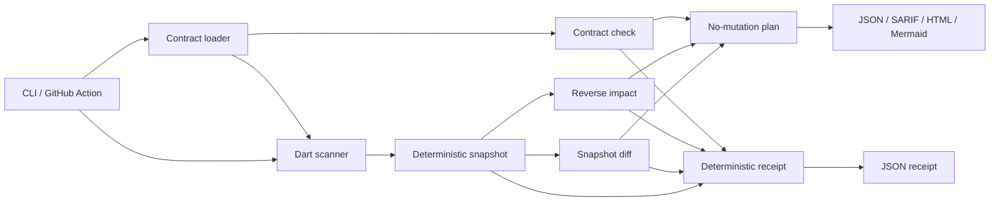

# ChangeWeaver


**Explainable architecture contracts and change-impact analysis for Dart and Flutter repositories.**

ChangeWeaver is a local-first Python CLI that turns architecture intent into reproducible evidence. It reads Dart/Flutter source conservatively, builds a deterministic import graph, compares snapshots, calculates reverse dependency impact, evaluates architecture contracts, and produces a no-mutation verification plan for developers and CI.

> ChangeWeaver does not replace Dart Analyzer, Flutter CLI, Melos, DCM, enola, or Drift. It connects a deliberately small set of concerns around an artifact that can be reviewed, stored, diffed, and enforced.

## Why it exists

Scaffolding tools are excellent at starting projects, and linters are excellent at flagging local violations. A reviewer still needs to understand what changed structurally, which parts of a Flutter codebase are affected, whether the change conflicts with declared architecture, and what should be verified before merge. ChangeWeaver addresses that workflow without requiring a server, API key, or LLM.

## What works in 0.1.0

| Capability | Command | Result |
|---|---|---|
| Create a contract | `changeweaver init` | `changeweaver.yaml` and artifact directory |
| Build a graph snapshot | `changeweaver snapshot` | Deterministic JSON snapshot with digest |
| Compare snapshots | `changeweaver diff` | Added/removed nodes and edges |
| Calculate blast radius | `changeweaver impact lib/domain/user.dart` | Reverse reachability, score, and path evidence |
| Enforce architecture rules | `changeweaver check --sarif` | Stable findings and SARIF 2.1.0 |
| Create an evidence receipt | `changeweaver verify --output ...` | Deterministic proof of the exact checks performed |
| Create a review plan | `changeweaver plan --target ...` | Ordered verification steps with no mutation |
| Render artifacts | `changeweaver render snapshot.json --format mermaid` | JSON, Mermaid, or HTML |

## Quick start

ChangeWeaver targets Python 3.11 or newer. Install it with its development dependencies from a checkout:

```bash
python -m venv .venv
. .venv/bin/activate
python -m pip install -e '.[dev]'
```

Inside a Dart or Flutter repository, initialize and inspect the contract:

```bash
changeweaver init
changeweaver snapshot --output .changeweaver/snapshots/current.json
changeweaver check
changeweaver impact lib/domain/user.dart
changeweaver plan --target lib/domain/user.dart
changeweaver verify --target lib/domain/user.dart --output .changeweaver/verification.json --json
```

The default contract is intentionally small and must be edited to describe the project’s actual architecture. Generated Dart files such as `*.g.dart` and `*.freezed.dart` are excluded by default.

## Contract example

```yaml
version: 1
project:
  name: sample_app
  roots: [lib, packages]
  include: ['**/*.dart']
  exclude: ['**/*.g.dart', '**/*.freezed.dart', '.dart_tool/**']
architecture:
  layers:
    - name: presentation
      paths: ['**/presentation/**', '**/widgets/**']
    - name: domain
      paths: ['**/domain/**']
    - name: data
      paths: ['**/data/**', '**/repositories/**']
  rules:
    - id: presentation-cannot-import-data
      from: [presentation]
      deny: [data]
      severity: error
      message: Presentation must depend on domain abstractions, not data implementations.
analysis:
  max_path_samples: 8
  max_nodes: 10000
```

Unknown keys fail closed. Unclassified files are reported explicitly. The lexical analyzer reports unresolved imports as diagnostics instead of inventing semantic relationships.

## Evidence-first verification

The `verify` command combines the current snapshot, an optional structural baseline diff, an optional reverse-impact analysis, and the architecture contract check. It records only the checks that actually ran and emits a deterministic receipt containing snapshot and baseline digests, finding counts, diagnostics, status, and a receipt digest.

```bash
changeweaver verify \
  --root . \
  --baseline .changeweaver/snapshots/baseline.json \
  --target lib/domain/user.dart \
  --output .changeweaver/verification.json \
  --json
```

The command is local-first and does not mutate source files. A failed enforced contract or error diagnostic returns exit code `1`; malformed input returns `2`.

## Architecture

The project uses a small hexagonal architecture. The domain owns immutable graph, finding, snapshot, plan, and verification-receipt models. Application services orchestrate snapshot, diff, impact, contract-check, and receipt use cases. Adapters read Dart and Pub facts. Infrastructure handles bounded filesystem access and canonical serialization. Presentation contains the CLI and renderers.



Read [`ARCHITECTURE.md`](ARCHITECTURE.md) for data flow, security boundaries, algorithm choices, and extension points.

## Exit codes and CI

| Code | Meaning |
|---:|---|
| 0 | Completed without an enforced regression. |
| 1 | An enforced architecture check failed. |
| 2 | Invalid input, malformed contract, unsafe repository, or analysis error. |
| 3 | Baseline and current artifacts are not safely comparable. |

SARIF output is designed for GitHub code-scanning ingestion:

```bash
changeweaver check --sarif > changeweaver.sarif
```

For evidence-first CI, persist the receipt as an artifact:

```bash
changeweaver verify --root . --output changeweaver-receipt.json --json
```

A minimal GitHub Action workflow is provided as [`docs/ci/quality.yml`](docs/ci/quality.yml). To activate it in a fork or with a token that has workflow-write permission, copy it to `.github/workflows/quality.yml`.

## Security and privacy

The tool operates locally and does not execute repository code, Flutter commands, package managers, hooks, or network requests. It refuses paths that escape the configured root, does not follow symlinks outside the root by default, bounds file and node counts, and escapes report output. No repository contents or credentials are uploaded.

## Current boundaries

The 0.1 analyzer is lexical and intentionally conservative. It understands common `import`, `export`, and `part` directives and local Pub package resolution, but it is not a complete Dart compiler or semantic refactoring engine. It does not infer runtime behavior, validate generated code, or prove that an unresolved import is unused. Those limitations are surfaced as diagnostics and are part of the protocol.

## Development

```bash
pytest
ruff check src tests
mypy src
python -m build
```

Fixtures under `tests/fixtures` represent a small Flutter-like project with a deliberate presentation-to-data violation. New behavior should add a focused unit test, a fixture regression when appropriate, and documentation for any protocol or exit-code change.

## Roadmap

The next releases can add a Dart Analyzer adapter, Pub Workspaces and Melos awareness, Flutter platform-boundary rules, GitHub Checks annotations, policy packs, and an explicit local plugin SDK. Optional AI explanations may be explored later, but they will never replace deterministic evidence or become a requirement for the core tool.

## License

ChangeWeaver is released under the MIT License. See [`LICENSE`](LICENSE).
